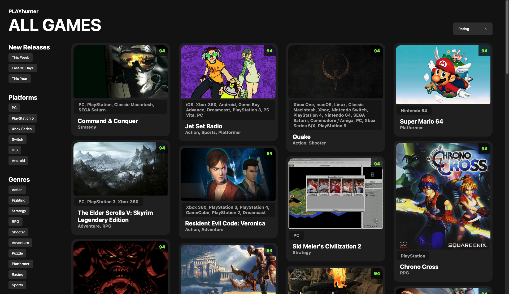

# PLAYHunter 
This is a video game discover app that clones some features from https://rawg.io

## YOU SHOULD KNOW
This code is purely frontend, but I did use an API proxy that is not posted here. The purpose of this proxy is twofold:
1. hide my API key
2. make requests to, and receive responses from, the RAWG API

If you are cloning this repo, please ensure that you have already registered for an API key from https://rawg.io. You can then manipulate public/rawgCall.js to directly ping the RAWG API or perhaps set up your own proxy

## FEATURES
- video game cards featuring an image, title, rating, and genres
- sorting by release dates and rating
- filtering by genres/platforms/new releases
- clickable cards (takes you either to the official game website or a google search)
- infinite scrolling 

## SCREENSHOTS

### Homepage

